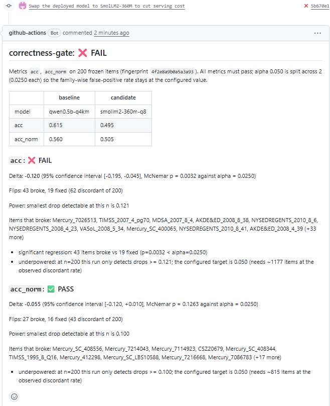

# correctness-gate

A CI (continuous integration) release gate for LLM quality. It derives its
decision rule from measured noise and sample size instead of a fixed
threshold, reports every verdict with a confidence interval and the smallest
drop it could have detected, and is itself tested against known-good and
known-bad quantized models.



*The gate's comment on [a pull request that swaps the deployed model for a
smaller one](https://github.com/marcusiq/correctness-gate/pull/3): 43 items
broke against 19 fixed, a significant regression, and the merge is blocked.*

## The gate's own eval

A gate is only useful if it passes changes that are noise and fails changes
that are real. So before it gates anything, it has to get five cases with
known answers right. The cases are Qwen2.5-3B-Instruct GGUF quantizations
whose quality was measured by perplexity in a separate project: two
noise-level swaps that must pass, an uncalibrated 2-bit model that must
fail, the calibration fix for that model that must pass, and one open
question that is reported, not asserted.

200 frozen arc_easy items, both metrics must pass, alpha 0.05 split across
the two metrics (0.025 each):

| case | baseline to candidate | expected | verdict | acc delta (p) | acc_norm delta (p) |
|---|---|---|---|---|---|
| noise | Q4_K_M to Q8_0 | PASS | **PASS** | +0.000 (1.000) | +0.045 (0.035) |
| noise | Q4_K_M to f16 | PASS | **PASS** | +0.005 (1.000) | +0.050 (0.041) |
| catastrophic | Q4_K_M to Q2_K (perplexity 23,190) | FAIL | **FAIL** | -0.490 (<0.0001) | -0.375 (<0.0001) |
| calibration recovery | Q2_K to Q2_K + imatrix | PASS | **PASS** | +0.490 (<0.0001) | +0.425 (<0.0001) |
| open question | Q4_K_M (ppl 8.67) to Q2_K + imatrix (ppl 10.48) | report | PASS, underpowered | +0.000 (1.000) | +0.050 (0.099) |

0 mismatches. What each row shows:

- **Catastrophic fails on the hard floor.** A drop of 0.15 or more fails
  outright, no statistics needed. Q2_K without calibration lost 49 points of
  accuracy.
- **Recovery passes and is flagged.** 106 items fixed against 8 broken. The
  gate reports a significant improvement and suggests promoting a new
  baseline, but never does it automatically.
- **The noise rows are close calls.** acc_norm moved +0.045 and +0.050 with
  raw p of 0.035 and 0.041. A single-metric gate at alpha 0.05 would have
  called both significant. With alpha split across two metrics they read as
  noise, which matches the perplexity data (these three quantizations are
  within noise of each other). Both directions of that tradeoff are visible
  in the numbers above, not hidden behind a pass/fail.
- **The open question gets an honest answer.** Perplexity separates Q4_K_M
  from Q2_K + imatrix (8.67 vs 10.48). 200 multiple-choice items cannot: the
  gate reports that at this n it can only detect drops of 0.087 (acc) and
  0.084 (acc_norm), and that it would need about 600 items to reach its
  0.05 target. A pass that cannot see the effect in question says so.

Reproduce (3B models on CUDA, about 5 minutes of scoring on an RTX 3060):

```bash
python scripts/run_validation.py --cache results/validation-cuda-run4
```

## Why fixed thresholds fail

The common pattern is "fail the build if accuracy drops more than 2 points".
The standard error of an accuracy measured on n items, bootstrapped from a
real run (Qwen2.5-0.5B Q4_K_M, acc_norm 0.56):

| items scored | SE of accuracy | 95% spread |
|---|---|---|
| 25 | 0.099 | +/- 0.194 |
| 50 | 0.072 | +/- 0.140 |
| 100 | 0.050 | +/- 0.097 |
| 200 | 0.035 | +/- 0.069 |

On 100 items a 2-point threshold sits well inside the noise. It fires on
nothing and misses real drops. A threshold only means something relative to
the variance of the measurement and the number of items behind it.

## What the gate does instead

**Paired comparison.** Baseline and candidate are scored on the same frozen
items, so the test looks only at the items where they disagree. An exact
McNemar test on items broken vs items fixed replaces a comparison of two
independent accuracies. Pairing removes the between-item variance, and that
is where most of the noise is:

| true drop to detect | items needed, paired (McNemar) | items needed, unpaired (two-proportion) |
|---|---|---|
| 0.02 | 1,470 | 9,670 |
| 0.03 | 652 | 4,298 |
| 0.05 | 234 | 1,548 |
| 0.08 | 90 | 605 |
| 0.10 | 57 | 387 |

Alpha 0.05, power 0.80, measured discordant rate 0.075 (Q4_K_M vs Q8_0 on
0.5B). About 6.6x fewer items for the same power. (The gate's own reports
ask for more items than this table because it splits alpha across two
metrics.)

**Every verdict carries:**

- the paired delta with a 95% bootstrap confidence interval,
- the McNemar p-value against the per-metric alpha,
- the items that broke and were fixed, by ID,
- the MDE (minimum detectable effect) at the current n and observed
  discordant rate. If the MDE is larger than the configured target of
  0.05, the report says the run is underpowered and how many items would
  fix it.

**It fails closed.** A comparison is refused, which counts as a failure,
when the item sets differ, when either record has no execution config,
when the execution configs differ, or when no metrics are configured.
Anything the gate cannot vouch for is a failure, never a silent pass.

Numbers: `python scripts/variance_study.py <run.json> --second <run.json>`.

## The scorer matches lm-evaluation-harness item for item

The gate uses its own multiple-choice scorer (summed continuation
log-likelihood, plus byte-length normalization for acc_norm), which is the
rule lm-evaluation-harness uses for arc_easy. Validated against an
lm-eval fixture on the same model and items (Qwen2.5-0.5B-Instruct, HF
float32, 50 items):

| | this scorer | lm-eval |
|---|---|---|
| acc | 0.58 | 0.58 |
| acc_norm | 0.64 | 0.64 |
| per-item pick agreement | 50/50 | |
| max log-likelihood difference | 0.0001 | |

`python scripts/validate_against_lm_eval.py`

## Cheap signals before expensive ones

Accuracy on 200 items is the expensive, low-resolution signal. Comparing
the models' token-level output distributions on a few prompts is cheap and
much more sensitive. Candidate vs an HF float32 reference, 20 items with
the gold answer forced (87 token positions), Qwen2.5-0.5B:

| candidate | mean abs logprob delta | max | greedy-flip rate | mean KL (nats) |
|---|---|---|---|---|
| Q8_0 | 0.400 | 3.85 | 6.9% | 0.071 |
| Q4_K_M | 0.624 | 7.96 | 25.3% | 0.182 |

KL is Kullback-Leibler divergence; a greedy flip is a position where the
two models' top token differs. These separate Q8_0 from Q4_K_M by 2.6x
(KL) and 3.7x (flips) in about 20 seconds. The 200-item accuracy
comparison of the same two models cannot tell them apart (acc +0.010,
p = 0.77). The funnel's job is to catch numeric changes early and cheaply;
accuracy decides whether they matter.

`cgate signals --reference qwen0.5b-hf --candidate qwen0.5b-q4km --k 20`

## Determinism: what moves the numbers when nothing changes

**Run to run: nothing.** Two separate processes scoring all five 3B models
on CUDA produced bit-identical log-probabilities in all 4,000 scored
continuations. Repeating a run measures nothing, so the determinism checks
vary configuration instead.

**Batch geometry: depends on the build and on what the process can see.**
The same 0.5B Q4_K_M model scores the 8 longest items (68 to 115 tokens)
with prompt processing split into chunks of 512 vs a smaller size. Max
absolute logit difference (greedy flips in parentheses):

| build and device | 512 vs 32 | 512 vs 8 | 512 vs 1 |
|---|---|---|---|
| CPU-only build (AVX2) | 0.0 | 0.0 | 0.98 (4) |
| CUDA build, GPU hidden, 0 layers offloaded | 0.0 | 0.0 | 1.10 (1) |
| CUDA build, GPU visible, 0 layers offloaded | 0.97 (2) | 1.56 (4) | 1.61 (3) |
| CUDA build, all layers offloaded | 0.88 (0) | 3.42 (2) | 2.76 (2) |

- On CPU, prompt processing is bit-identical for any chunk of 8 or more
  tokens. Only one token at a time (a different kernel path) differs. The
  gate scores whole sequences in one chunk, so it stays on the invariant
  path.
- **"0 layers offloaded" does not mean "CPU".** With a CUDA build and a
  visible GPU, the numbers change with chunk size exactly like a GPU run.
  llama.cpp still sends large matrix multiplications to the GPU. Setting
  `CUDA_VISIBLE_DEVICES=` removes the effect.
- On GPU, chunk size changes the kernels and the numbers.

`python scripts/invariance_longest.py --device cpu` (and `--device cuda`)

**Offload configuration changes decisions.** The same five 3B models
scored with all layers on the GPU vs 0 layers offloaded on the CUDA
build: 89 of 2,000 per-item decisions changed. acc_norm on Q4_K_M moved
0.015, about a third of the gate's 0.05 target, and the open-question case
went from p = 0.099 to p = 0.42. Unquantized f16 changed 3 of 400
decisions; Q2_K changed 53. The effect grows as quantization gets coarser.
Details and per-model tables in
[docs/determinism-and-devices.md](docs/determinism-and-devices.md).

## The config fingerprint

Every run record carries the execution config that produced it (backend,
device, GPU layers, context, batch size, threads, whether the llama.cpp
build has GPU support, which GPUs the process could see, library version;
dtype and TF32 for the HF backend) and a hash of it. The gate refuses to
compare two records whose hashes differ. The first CI run against a
baseline scored on the GPU failed with:

```
execution configs differ: {'gpu_build': (None, False), 'n_gpu_layers': (-1, 0), 'device': ('cuda', 'cpu')}
```

That is the intended behavior. A quality change and a config change are
not separable from two runs, so the gate does not guess.

The GPU-build and visibility fields were added after a measurement showed
they were missing. A "0 layers offloaded" run on a CUDA build and a true
CPU run used to write identical configs, yet on 10 items of the 3B Q4_K_M
model their log-probabilities differ by up to 4.1 nats. Every earlier
mislabeling in this project had the same shape: something that moves the
numbers, absent from the record. The fix each time was to record it.

## In CI

`.github/workflows/gate.yml` runs on every pull request that touches
configs, the package, the data, the baseline, or dependencies:

1. **unit**: builds llama-cpp-python for a fixed instruction set (AVX2,
   no AVX-512, not tuned to the build machine) and caches the result.
   Every runner therefore runs the same kernels, whatever CPU it lands on.
   Then pytest.
2. **model-gate**: downloads the model named by `under_test` in
   `configs/models.yaml`, scores it on the 200 items, uploads the run
   record, gates it against `baselines/qwen0.5b-q4km.json`, and posts the
   report as a PR comment. A FAIL fails the check and blocks the merge.

The baseline is promoted from a runner-produced record, never a local one.
Baseline promotion is always a manual commit.

### CPU scoring is portable across machines

The same 200-item run of Qwen2.5-0.5B Q4_K_M on three different CPUs,
all using the fixed-instruction-set build:

| machine | CPU | acc | acc_norm | vs the others |
|---|---|---|---|---|
| local | Intel Core i5-11600KF (AVX-512 capable) | 0.615 | 0.560 | |
| GitHub runner 1 | AMD EPYC 9V74 (Zen 4, AVX-512 capable) | 0.615 | 0.560 | bit-identical |
| GitHub runner 2 | AMD EPYC 7763 (Zen 3, no AVX-512) | 0.615 | 0.560 | bit-identical |

All 800 scored continuations match exactly, 0 of 200 decisions change,
and the runner-2 gate against the runner-1 baseline passes with a delta of
+0.000 and a confidence interval of [0.000, 0.000]. Two CPU vendors, and
machines with and without AVX-512, produce the same numbers because the
build does not let each machine pick its own kernels.

```bash
python scripts/diff_runs.py results/runner-1 results/runner-2
python scripts/diff_runs.py results/local-cpu-avx2 results/runner-1
```

**Job times** (private-repo runners, 2 vCPUs): `unit` takes 7m03s on a cold
cache (it compiles llama.cpp) and 27s warm; `model-gate` takes 8m38s,
almost all of it scoring 200 items.

### Three pull requests, three verdicts

Each demo PR changes one line, the `under_test` model in
`configs/models.yaml`. They stay open as a record of what the gate does.

| PR | change | acc | acc_norm | verdict |
|---|---|---|---|---|
| [#1](https://github.com/marcusiq/correctness-gate/pull/1) | Qwen2.5-0.5B Q4_K_M to Q8_0 | +0.010 (p = 0.77) | -0.015 (p = 0.61) | PASS |
| [#2](https://github.com/marcusiq/correctness-gate/pull/2) | Q4_K_M to Qwen's published Q2_K | -0.020 (p = 0.54) | -0.030 (p = 0.34) | PASS, underpowered |
| [#3](https://github.com/marcusiq/correctness-gate/pull/3) | Qwen2.5-0.5B to SmolLM2-360M | **-0.120 (p = 0.003)** | -0.055 (p = 0.13) | **FAIL** |

PR #2 was meant to be the failing case, on the assumption that a 2-bit
0.5B model is badly degraded. It is not: Qwen's published Q2_K loses 2 to 3
points. At 200 items the gate can only detect drops of 0.075 (acc) and
0.081 (acc_norm), so it passes and says so, with the item count it would
need (about 450 to 530). That is the correct answer. A real regression
below the detection limit is reported as exactly that, not hidden and not
promoted to a failure.

PRs #1 and #3 match what the same models scored locally before the PRs
were opened, to three decimal places.

## Quick start

```bash
git clone https://github.com/marcusiq/correctness-gate && cd correctness-gate
python3 -m venv .venv && source .venv/bin/activate
pip install -e ".[dev]"      # compiles llama.cpp, takes a few minutes
pytest -q
python scripts/fetch_model.py --model qwen0.5b-q4km
python scripts/fetch_model.py --model qwen0.5b-q8
cgate run --model qwen0.5b-q4km --limit 20 --out results/a.json
cgate run --model qwen0.5b-q8   --limit 20 --out results/b.json
cgate compare --baseline results/a.json --candidate results/b.json
```

On a fresh clone (6 CPU cores) the whole sequence took 3.5 minutes: 2.5 to
install, most of it compiling llama.cpp, and under a minute for everything
after. Expect a PASS that says it is badly underpowered: at n = 20 it can
only detect drops of roughly 0.15 or more. Drop `--limit` for the full 200
items.

## Hardware

All numbers above were measured on:

| | |
|---|---|
| CPU | Intel Core i5-11600KF, 6 cores / 12 threads (WSL2 VM sees 6) |
| GPU | NVIDIA GeForce RTX 3060, 12 GB, driver 591.86 |
| RAM | 16 GB host, 10 GB assigned to WSL2 |
| OS | Windows 11, WSL2 Ubuntu 24.04 |
| Software | Python 3.12.3, llama-cpp-python 0.3.35, torch 2.13.0+cu130, transformers 5.14.1 |

CI runs on GitHub-hosted `ubuntu-24.04` runners.

## Limitations

- **One task family.** 200 arc_easy multiple-choice items. The statistics
  are task-agnostic, but only this scorer exists so far.
- **200 items is underpowered for 0.05.** Every validation case says so.
  Detecting a 5-point drop at the gate's alpha takes roughly 280 to 600
  items, depending on how often the two models disagree.
- **Item sampling is not measurement noise.** Run-to-run noise at a fixed
  config is zero. The uncertainty the gate reports comes from which 200
  items were drawn. A verdict is about this frozen set, and generalizes to
  the task only as far as the set represents it.
- **The 3B validation is local.** It runs on CUDA on the machine above.
  The CI tier is 0.5B on CPU.
- **Bonferroni is conservative.** Splitting alpha across metrics keeps the
  family-wise false-positive rate at 0.05 and costs power. The noise rows
  above show exactly what it trades.

## Layout

```
correctness_gate/   package: backends, scorer, statistics, gate, signals, CLI
configs/            models.yaml (under_test + model specs), gate.yaml (alpha, power, MDE, floor)
data/               arc_easy_200.json, the frozen item set
baselines/          the promoted baseline the CI gate compares against
validation/         five-case spec, lm-eval fixture
results/            committed run records behind every number here
scripts/            validation, variance study, invariance, diffs, model fetch
docs/               determinism-and-devices.md
```
